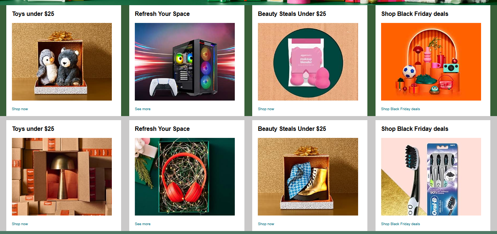
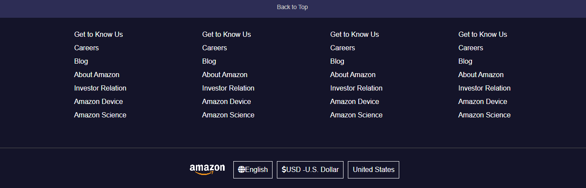

# Amazon Homepage Clone

A frontend clone of the Amazon homepage built using HTML and CSS.  
This project was created as part of my frontend web development learning journey to practice real-world website layouts and styling techniques.

---

## Overview

The Amazon Homepage Clone is a beginner frontend project that recreates the layout and design of Amazon’s homepage.

The goal of this project was to improve my understanding of:

- HTML structure
- CSS styling
- Flexbox layouts
- Website positioning
- Real-world UI cloning

---

##  Features

- Amazon-style navigation bar
- Search bar section
- Hero/banner section
- Product cards layout
- Multiple content sections
- Footer section
- Responsive webpage structure

---

## 🛠️ Technologies Used

- HTML5
- CSS3

---

## 📂 Project Structure

```bash
amazon-homepage-clone/
│
├── index.html
├── style.css
├── images/
├── screenshots/
└── README.md
```

---

## 📸 Screenshots

### Hero Section

<p align="center">
  
</p>

---

### Product Section

<p align="center">
  
</p>

---

### Footer Section

<p align="center">
  
</p>

---

## What I Learned

Through this project, I learned:

- Creating real-world webpage layouts
- Using Flexbox for alignment
- Styling navigation bars
- Building responsive sections
- Organizing webpage structure
- Improving CSS positioning skills

---

## Future Improvements

Planned improvements for this project:

- Add full responsiveness for mobile devices
- Add JavaScript functionality
- Create product detail pages
- Improve animations and hover effects
- Add dark mode support


---

## ⭐ Note

This project was built for educational and practice purposes only and is not affiliated with Amazon.
